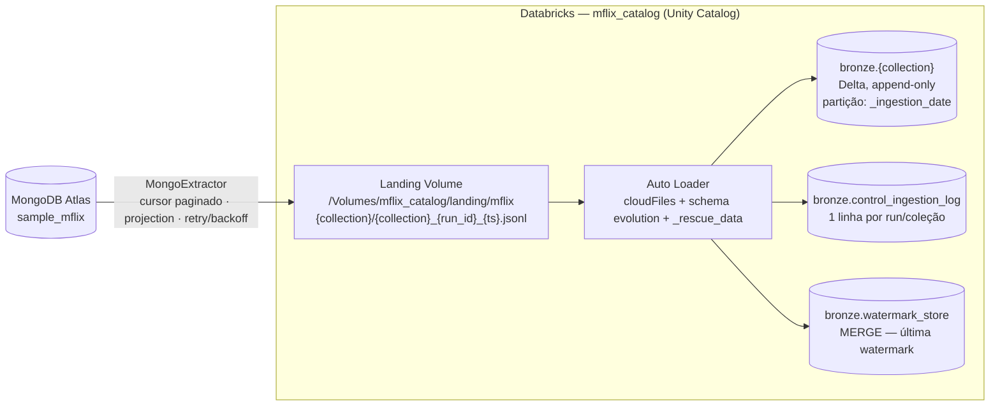

# Ingestão sample_mflix → Bronze

Pipeline de ingestão que extrai as coleções do banco `sample_mflix` (MongoDB Atlas)
e as materializa na camada **Bronze** de um Data Lake no Databricks (Delta Lake +
Unity Catalog), com rastreabilidade completa, carga incremental idempotente e
observabilidade sobre as execuções.

---

## Arquitetura



O fluxo tem **três etapas** por coleção, orquestradas pelo notebook
`notebooks/01_run_pipeline.py`:

1. **Extract** (`src/extractor.py`) — lê o MongoDB via cursor paginado e grava um
   arquivo JSONL por execução na Landing Zone (um Volume do Unity Catalog).
2. **Load** (`src/loader.py`) — o Auto Loader lê os arquivos novos da Landing,
   adiciona as colunas de rastreabilidade e grava na tabela Bronze Delta.
3. **Control** (`src/control.py`) — persiste a watermark (`MERGE`) e registra o
   resultado da execução em `control_ingestion_log`.

Detalhes completos e o diagrama de dados por coleção estão em
[`docs/ARQUITETURA.md`](docs/ARQUITETURA.md). A referência do dataset está em
[`docs/SAMPLE_MFLIX.md`](docs/SAMPLE_MFLIX.md).

### Camadas

| Camada | Local | Característica |
|---|---|---|
| Landing | `/Volumes/mflix_catalog/landing/mflix/{collection}/` | JSONL, um arquivo por run, nunca deletado (auditoria) |
| Bronze | `mflix_catalog.bronze.{collection}` | Delta, append-only, particionado por `_ingestion_date` |
| Control | `mflix_catalog.bronze.control_ingestion_log` / `watermark_store` | log de execuções e watermarks persistidas |

### Modos de carga por coleção

| Coleção | Modo | Watermark | Motivo |
|---|---|---|---|
| `movies` | incremental | `lastupdated` (string) | comparação lexicográfica válida para `YYYY-MM-DD HH:MM:SS` |
| `comments` | incremental | `date` (ISODate) | maior volume (~50k); ISODate nativo confiável |
| `users` | full | — | ~185 docs, sem campo de atualização |
| `theaters` | full | — | ~1.500 docs, dado geográfico estático |
| `sessions` | full | — | pode estar vazia; `count=0` é tratado sem erro |
| `embedded_movies` | full | — | `plot_embedding` (~42 MB de vetores) excluído por projection |

---

## Decisões técnicas

**Ingestão orientada a arquivos (Landing + Auto Loader).**
Em vez de escrever direto do MongoDB para o Delta, cada execução gera um JSONL na
Landing e o Auto Loader consome esses arquivos. Isso desacopla extração e carga,
dá reprocessamento trivial (o arquivo bruto continua lá) e entrega
exatamente-uma-vez via checkpoint.

**JSONL na Landing.**
Formato nativo do MongoDB — um documento por linha, tipos BSON serializados como
string (`ObjectId`, `ISODate`). Permite escrita e leitura linha a linha, sem
carregar tudo em memória.

**`trigger(availableNow=True)` na carga Bronze.**
Semântica de micro-batch determinística: processa todos os arquivos pendentes e
para. Comportamento batch, sem custo de streaming contínuo.

**Idempotência: append-only + run_id único.**
Cada execução tem um `_ingestion_id` (UUID) e gera um arquivo novo na Landing com
esse id no nome. O checkpoint do Auto Loader ignora arquivos já processados, então
rodar a pipeline duas vezes não duplica nem corrompe a Bronze — que nunca sofre
`MERGE`/`DELETE`. Na carga incremental, o filtro `{watermark_field: {$gt: watermark}}`
já evita reler o que passou.

**Schema drift: `schemaEvolutionMode = addNewColumns` + `_rescue_data`.**
Campos novos na origem são absorvidos automaticamente; campos não mapeados ou com
tipo divergente caem em `_rescue_data` e nunca são descartados silenciosamente.
Impacto na Silver: queries devem considerar `_rescue_data` para campos que podem
ter mudado de tipo entre versões.

**Watermark como string, via `MERGE` em `watermark_store`.**
Uma linha por coleção, atualizada por upsert ao final de cada incremental
bem-sucedido. String cobre tanto `lastupdated` (texto) quanto `date` (ISODate
convertida com `str()`).

**Boas práticas de recursos.**
Cursor iterado doc a doc (sem `list(cursor)`), `batchSize` configurável por
coleção, projection/pushdown para não trazer campos pesados (`plot_embedding`,
`poster`, `password`, `jwt`), um único `MongoClient` reusado entre coleções,
`retry_with_backoff` nas chamadas de rede e particionamento por `_ingestion_date`
para evitar *small files*.

**Reconciliação (R8).**
Ao fim de cada coleção compara `qtd_lida_origem` × `qtd_gravada_destino`. Acima do
limiar `quality_threshold_pct` (padrão 1%) a execução é marcada `PARTIAL`.
Validações extras (nulos em `_source_id`, duplicidade no mesmo lote,
observabilidade) estão em `notebooks/02_validate_bronze.py`.

**Configuração externalizada.**
Nada de credenciais ou parâmetros hardcoded: `config/pipeline_config.yaml` traz
catálogo/paths/secret scope e `config/collections.json` os parâmetros por coleção.
A connection string fica no Databricks Secret Scope `conn-db`.

### Colunas de rastreabilidade (toda tabela Bronze)

`_ingestion_id`, `_ingestion_timestamp`, `_source_path`, `_load_type`,
`_ingestion_date` (partição) e `_source_id` (`_id` da origem, `UNKNOWN` se ausente).

---

## Como executar

### Pré-requisitos

- Workspace Databricks com Unity Catalog e permissão para criar catálogo/schema/volume
- Cluster com Databricks Runtime 15.4 LTS (Spark 3.5)
- Acesso a um cluster MongoDB Atlas com o dataset `sample_mflix` carregado
- Repo clonado no Databricks (**Repos**), ou os notebooks importados no Workspace

### 1. Configurar o secret (uma vez, por um admin)

Abra `notebooks/00_setup_secrets.py` no Databricks, preencha `MONGODB_URI` com a
connection string real **apenas na execução manual** (nunca commite) e rode o
notebook. Ele cria o scope `conn-db` e a chave `cnn-mongodb-sampleflix`.

### 2. Ajustar a configuração

- Em `notebooks/01_run_pipeline.py`, ajuste `REPO_ROOT` para o caminho do Repo
  (`/Workspace/Repos/<seu-user>/ENG_DADOS_INGESTAO_DBMFLIX_T3`).
- Revise `config/pipeline_config.yaml` (catálogo, paths) e `config/collections.json`
  se quiser mudar modo de carga ou projection.

### 3. Rodar a pipeline

Execute `notebooks/01_run_pipeline.py`. Ele:

1. provisiona catálogo, schemas e volume (`IF NOT EXISTS`, idempotente);
2. processa as 6 coleções com o mesmo código;
3. imprime um resumo e a query de `control_ingestion_log` para o `run_id` atual.

### 4. Validar

Execute `notebooks/02_validate_bronze.py` para reconciliação, checagem de nulos/
duplicatas e o painel de observabilidade sobre `control_ingestion_log`.

### 5. Agendamento (opcional)

`jobs/ingestion_workflow.json` define um Workflow Databricks (via API/CLI Jobs)
que roda `01_run_pipeline` → `02_validate_bronze` diariamente às 06h UTC, com
`retry` e notificação de falha por e-mail.

### Testes unitários

```bash
pip install pytest pymongo pyyaml
pytest tests/
```

Os testes de `utils`, `extractor` e `control` mockam Spark, `pymongo` e `bson`,
então rodam fora do Databricks.

---

## Estrutura do repositório

```
config/
  pipeline_config.yaml     configuração geral (sem credenciais)
  collections.json         parâmetros por coleção
src/
  extractor.py             MongoDB → JSONL na Landing
  loader.py                Auto Loader → Bronze Delta
  control.py               watermark_store + control_ingestion_log
  utils.py                 serialização BSON, retry/backoff, run_id, hash
notebooks/
  00_setup_secrets.py      cria o Secret Scope (rodar uma vez)
  01_run_pipeline.py       orquestrador principal
  02_validate_bronze.py    validações de qualidade e observabilidade
jobs/
  ingestion_workflow.json  definição do Workflow agendado
tests/                     testes unitários (pytest)
docs/
  ARQUITETURA.md           diagrama e decisões detalhadas
  SAMPLE_MFLIX.md          referência do dataset
```

> `Exercicios.py`, `mongo_reader*.py`, `create-secret.py` e `code-samples/` são
> material de exploração/estudo e não fazem parte da pipeline.

---

## Limitações conhecidas

- **Watermark lexicográfica em `movies`**: `lastupdated` é string; a comparação só
  é válida enquanto o formato `YYYY-MM-DD HH:MM:SS` se mantiver. Documentos sem o
  campo entram apenas na carga full inicial.
- **`get_max_watermark` recalcula com filtro vazio** após a extração — assume que
  a coleção não recebeu escritas com data anterior à watermark entre a leitura e
  esse cálculo.
- **`control.py` monta SQL por interpolação de string** (`MERGE`/`INSERT`).
  Aceitável aqui porque os valores vêm da configuração e da própria pipeline, não
  de entrada externa; ainda assim, um erro em campo de texto (aspas em
  `mensagem_erro`) pode quebrar o log.
- **Sem CDC**: a carga incremental é por campo de data, não via Change Streams.
- **Provisionamento de infraestrutura** depende de permissões de Unity Catalog;
  em workspaces sem admin os passos falham com aviso e a pipeline segue.
- O contador de linhas gravadas relê a tabela filtrando por `_ingestion_id` após
  o `awaitTermination`, o que adiciona uma varredura por coleção.

---

## Contribuições

| Membro | Contribuições principais |
|--------|--------------------------|
| Eliak Lima | setup de secrets, configuração do Atlas, estrutura do projeto |
| Renan Madeira | `extractor.py`, orquestrador `01_run_pipeline.py` |
| Raul Carvalho Teles | `control.py`, watermark, testes unitários, `02_validate_bronze.py` |
| Leivio Fontenele | `loader.py`, Workflow/agendamento, documentação |

> Detalhamento por commit: `git log --oneline --author="<nome>"`.
</content>
</invoke>
