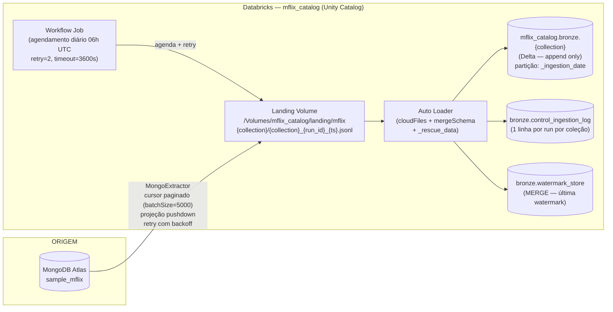

# Arquitetura — Ingestão sample_mflix

Documentação das decisões técnicas reais da nossa implementação.

---

## Fluxo da Solução



---

## Camadas

### Landing
- **Volume:** `/Volumes/mflix_catalog/landing/mflix`
- Um arquivo JSONL por coleção por execução (run_id único)
- Nomenclatura: `{collection}/{collection}_{run_id}_{timestamp}.jsonl`
- Arquivos nunca deletados — auditoria histórica completa

### Bronze
- **Catálogo:** `mflix_catalog.bronze.{collection}`
- Append-only — sem transformação de negócio
- Particionada por `_ingestion_date`
- Colunas de rastreabilidade obrigatórias (R4)
- Schema evolution via Auto Loader (`addNewColumns`)
- Campos desconhecidos preservados em `_rescue_data`

### Control
- `mflix_catalog.bronze.control_ingestion_log` — log de execuções (R5)
- `mflix_catalog.bronze.watermark_store` — watermarks persistidas (R3)

---

## Decisões Técnicas

**Formato dos arquivos na landing:**
```
Decisão: JSONL (JSON Lines)
Justificativa: Formato nativo do MongoDB. Cada documento é uma linha,
preservando tipos BSON como strings serializadas (ObjectId, ISODate).
Lido eficientemente pelo Auto Loader sem parser especial.
Permite streaming linha a linha sem carregar tudo na memória.
```

**Trigger do job Bronze:**
```
Decisão: trigger(availableNow=True)
Justificativa: Semântica de micro-batch determinística — processa todos
os arquivos novos disponíveis na landing e para. Sem custo de streaming
contínuo. Checkpoint integrado garante exatamente-uma-vez.
Adequado a cargas batch agendadas.
```

**Estratégia de idempotência na Bronze:**
```
Decisão: Append-only com _ingestion_id único por execução
Justificativa: Cada run tem um UUID único (_ingestion_id). Re-execuções
geram novo _ingestion_id e novo arquivo na landing com novo nome
(contém o run_id). O Auto Loader com checkpoint detecta que o arquivo
já foi processado e não o processa novamente.
Bronze permanece como auditoria completa — sem MERGE ou DELETE.
```

**Tratamento de schema drift:**
```
Decisão: cloudFiles.schemaEvolutionMode = addNewColumns + _rescue_data
Justificativa: Novos campos surgindo na origem são absorvidos
automaticamente sem quebrar o pipeline. Campos não mapeados ficam
em _rescue_data — nunca são descartados silenciosamente.
Documentos com tipos divergentes são preservados via _rescue_data.
Impacto na Silver: queries devem considerar _rescue_data para campos
que podem ter migrado de tipo entre versões.
```

**Modos de carga por coleção:**

| Coleção | Modo | Watermark field | Justificativa |
|---|---|---|---|
| `movies` | incremental | `lastupdated` (string) | Campo de atualização natural. Comparação lexicográfica válida para `YYYY-MM-DD HH:MM:SS`. Docs sem `lastupdated` incluídos apenas na carga full inicial. |
| `comments` | incremental | `date` (ISODate) | Maior volume (~50k). ISODate nativo — confiável para watermark. Range 1999–2016. |
| `users` | full | — | ~185 docs. Sem campo de atualização. Carga total negligível. |
| `theaters` | full | — | ~1.500 docs. Dado geográfico estático. |
| `sessions` | full | — | Pode estar vazia. Pipeline trata `count=0` explicitamente sem exceção. |
| `embedded_movies` | full | — | `plot_embedding` excluído por projection (~42 MB de vetores). Volume gerenciável sem incremental. |

---

## Boas Práticas de Recursos (R2)

| Técnica | Onde aplicado |
|---|---|
| Leitura paginada (`batchSize=5000`) | `MongoExtractor.extract()` — cursor iterado doc a doc |
| Projection / pushdown | Configurado em `collections.json` por coleção; aplicado no `.find(projection=...)` |
| Sem `list(cursor)` nem `collect()` | `extract()` itera o cursor diretamente; Auto Loader processa distribuído |
| Connection pooling | Um `MongoClient` por execução, reusado para todas as coleções |
| Retry com backoff | `retry_with_backoff()` em `utils.py`; aplicado ao `.find()` e escrita |
| Controle de partições | Particionamento por `_ingestion_date` — evita small files, 1 partição/dia/coleção |

---

## Diagrama de Fluxo de Dados por Coleção

```
Para cada coleção em collections.json:

  [MongoDB] ──cursor─► [extractor.py]
                              │
                    serializa BSON → JSON
                    escreve linha a linha
                    sem list(cursor)
                              │
                              ▼
              [landing/{collection}/{run_id}.jsonl]
                              │
                        Auto Loader
                    schemaEvolutionMode=addNewColumns
                    includeExistingFiles=true
                    trigger(availableNow=True)
                              │
                    + colunas rastreabilidade
                    _ingestion_id, _timestamp,
                    _source_path, _load_type,
                    _ingestion_date, _source_id
                              │
                              ▼
              [mflix_catalog.bronze.{collection}]
                    Delta, append-only
                    partição: _ingestion_date
                              │
              ┌───────────────┴───────────────┐
              ▼                               ▼
    [watermark_store]           [control_ingestion_log]
    MERGE watermark             1 linha por run:
    (apenas incremental)        qtd_lida, qtd_gravada,
                                status, duracao, erro
```
